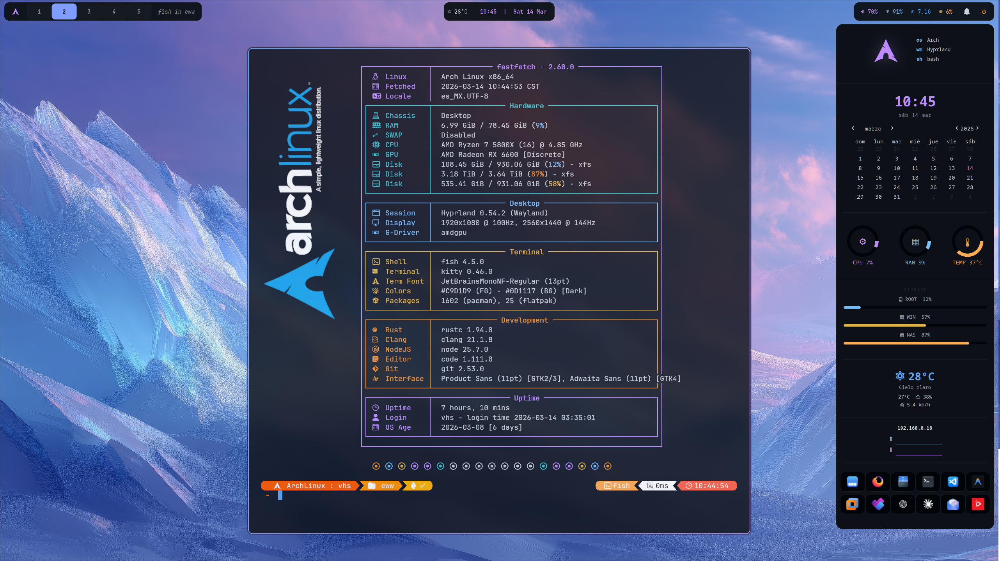

# Vic's Hyprland Dotfiles

Setup personal de Hyprland sobre Arch Linux.

---

## Sistema

| Item | Detalle |
|---|---|
| **OS** | Arch Linux |
| **WM** | Hyprland 0.54+ |
| **DE base** | Hyprland standalone (usa componentes Qt/KDE sin el DE completo) |
| **GPU** | AMD Radeon RX 6600 |
| **Monitores** | 2560x1440 @ 144Hz · scale 1.1 (DP-1) + 1920x1080 @ 100Hz (HDMI-A-1) |
| **Temas** | Catppuccin · Catppuccin Latte · Dracula · Dynamic (Matugen) · Everforest · Flick0 Aurora · GitHub Dark · Graphite · Kanagawa · Nord · Tokyo Night · Yorha + más |
| **Íconos** | Slot-Beauty-Dark-Icons |
| **Cursor** | Catppuccin Mocha Dark |
| **Fuentes** | Product Sans · JetBrains Mono Nerd Font · Orbitron |

---

## Software incluido

### Core
| Paquete | Rol |
|---|---|
| `hyprland` | Compositor Wayland |
| `waybar` | Barra de estado (solo en DP-1) — switchable con `bar-switch.sh` |
| `swww` | Wallpaper con transiciones |
| `hyprlock` | Pantalla de bloqueo |
| `hypridle` | Daemon de inactividad |
| `wlogout` | Power menu |
| `hyprswitch` | Alt+Tab con preview de ventanas |
| `arch-update` | Notificador de actualizaciones en system tray |
| `theme-switcher` | Cambio de tema completo con un atajo (waybar, borders, kitty, hyprlock, rofi, eww, swaync, wlogout) |
| `jq` | Requerido por theme-switcher para parsear JSON |
| `imagemagick` | Miniaturas en el theme/wallpaper picker |
| `matugen` | *(opcional)* Genera paleta de colores desde wallpaper para el tema Dynamic |
| `swaync` | Centro de notificaciones (tematizado) |

### Shell y terminal
| Paquete | Rol |
|---|---|
| `kitty` | Terminal |
| `fish` | Shell |
| `oh-my-posh` | Prompt (tema zen.toml activo) |
| `fastfetch` | Info del sistema al abrir terminal |

### Apps y utilidades
| Paquete | Rol |
|---|---|
| `rofi-wayland` | Launcher (Spotlight + Launchpad) |
| `mako` | Notificaciones |
| `eww` | Widgets de escritorio (reloj + sidebar con sysmonitor, clima, red y launchers de apps) |
| `dolphin` | File manager |
| `plasma-integration` | Integración KDE para apps Qt fuera de Plasma |
| `kde-cli-tools` | Herramientas KDE (Open With, etc.) |
| `pavucontrol` | Control de volumen |
| `handlr-regex` | Gestor de apps por defecto |

### Screenshots y portapapeles
| Paquete | Rol |
|---|---|
| `grim` + `slurp` | Capturas de pantalla |
| `wl-clipboard` + `cliphist` | Portapapeles Wayland |

### Temas
| Paquete | Rol |
|---|---|
| `catppuccin-gtk-theme-mocha` | Tema GTK |
| `kvantum-theme-catppuccin-git` | Tema Qt/KDE |
| `catppuccin-cursors-mocha` | Cursores |
| `papirus-icon-theme` | Íconos base (requerido) |
| `Slot-Beauty-Dark-Icons` | Íconos activos (en ~/.local/share/icons/) |

### Plugins Hyprland (hyprpm)
| Plugin | Rol |
|---|---|
| `hyprexpo` | Vista general de workspaces (Exposé) |

---

## Instalación

### Requisitos previos
- Arch Linux instalado con Hyprland
- `yay` instalado
- Drivers AMD (`mesa`, `vulkan-radeon`)

### Paso 1 — Instalar software

```bash
./install.sh
```

### Paso 2 — Aplicar dotfiles

```bash
./deploy.sh
```

Copia todos los configs, hace backup automático de existentes (`.bak`) y aplica fixes necesarios.

### Paso 3 — Pasos manuales post-deploy

**Tema Qt (Kvantum):**
```bash
kvantummanager
# Change/Delete Theme → Catppuccin-Mocha → Use this theme
```

**Fix Open With en Dolphin** (una sola vez, requiere sudo):
```bash
sudo ln -s /etc/xdg/menus/plasma-applications.menu /etc/xdg/menus/applications.menu
```

**Verificar monitores (primera vez):**
```bash
hyprctl monitors
# Confirmar DP-1 y HDMI-A-1
# Si difieren, editar hyprland.conf y wallpaper.sh
```

**Íconos Slot-Beauty-Dark-Icons:**
Deben estar en `~/.local/share/icons/Slot-Beauty-Dark-Icons/`
(copiar desde Windows partition si aplica: `/run/media/Windows/vhs/.local/share/icons/`)

---

## Atajos de teclado

### Básicos
| Atajo | Acción |
|---|---|
| `Super + Enter` | Terminal (kitty) |
| `Super + Space` | Launchpad (grid de apps) |
| `Super + A` | Spotlight (búsqueda rápida) |
| `Super + E` | Dolphin (archivos) |
| `Super + Q` / `Alt + F4` | Cerrar ventana |
| `Alt + Tab` | Switcher de ventanas (hyprswitch) |
| `Super + Tab` | Vista Exposé (todos los workspaces) |
| `Super + V` | Historial del portapapeles |
| `Super + Delete` / `Super + L` | Bloquear pantalla |
| `Super + S` | Guía de atajos (cheatsheet) |
| `Super + F1` | Theme picker (cambia tema completo) |
| `Super + W` | Wallpaper picker (wallpapers del tema activo) |
| `Super + Shift + E` | Power menu |
| `Super + Shift + M` | Cerrar sesión |

### Ventanas
| Atajo | Acción |
|---|---|
| `Super + Shift + Space` | Flotante on/off |
| `Super + F` | Pantalla completa |
| `Super + flechas / H J K L` | Mover foco |
| `Super + Shift + flechas` | Mover ventana |
| `Super + Ctrl + flechas` | Redimensionar (mantener presionado) |
| `Super + mouse izq` | Mover ventana flotante |
| `Super + mouse der` | Redimensionar flotante |

### Ventanas — Minimizar
| Atajo | Acción |
|---|---|
| `Super + M` | Minimizar ventana activa |
| `Super + N` | Restaurar última ventana minimizada |
| `Super + Ctrl + M` | Minimizar todas las ventanas |
| `Super + Ctrl + N` | Restaurar todas las ventanas |

### Workspaces
| Atajo | Acción |
|---|---|
| `Super + 1..9` | Cambiar workspace |
| `Super + Shift + 1..9` | Mover ventana a workspace |
| `Super + scroll` | Navegar workspaces |

### Screenshots
| Atajo | Acción |
|---|---|
| `Print` | Selección de área → portapapeles |
| `Shift + Print` | Pantalla completa → ~/Imágenes/ |
| `Ctrl + Print` | Pantalla completa → portapapeles |

### Multimedia
| Atajo | Acción |
|---|---|
| Teclas de volumen | Subir / bajar / mute |
| Teclas de media | Play·Pause / Siguiente / Anterior |
| Teclas de brillo | +5% / -5% |

---

## Estructura

```
~/Code/hyperland/
├── install.sh
├── deploy.sh
├── README.md
└── dotfiles/
    ├── hypr/
    │   ├── hyprland.conf          # Config principal (monitores, atajos, reglas)
    │   ├── hypridle.conf          # Daemon de inactividad
    │   ├── hyprlock.conf          # Pantalla de bloqueo
    │   ├── wallpaper.sh           # Script de wallpaper (swww)
    │   ├── hotcorner.sh           # Hot corner → Exposé
    │   ├── modules/               # Config modular (autostart, keybindings, rules, etc.)
    │   └── scripts/
    │       ├── gtk.sh             # Aplicar temas GTK
    │       ├── bar-switch.sh      # Lanza waybar o barra alternativa según argumento
    │       ├── minimize-all.sh    # Minimizar todas las ventanas (Super+Ctrl+M)
    │       ├── unminimize.sh      # Restaurar última ventana minimizada (Super+N)
    │       └── unminimize-all.sh  # Restaurar todas las ventanas (Super+Ctrl+N)
    ├── waybar/
    │   ├── config.jsonc           # Módulos (solo DP-1), reloj con fecha y calendario, swaync
    │   ├── config                 # Config alternativa (sin swaync)
    │   └── style.css              # Estilos (tematizados por theme-switcher)
    ├── rofi/
    │   ├── config.rasi            # Config base
    │   ├── spotlight.rasi         # Tema Spotlight (Super+A)
    │   └── launchpad.rasi         # Tema Launchpad grid (Super+Space)
    ├── hyprswitch/
    │   ├── style.css              # Estilo Aurora (glass dark + glow)
    │   └── launch.sh             # Script Alt+Tab con detección de monitor
    ├── eww/
    │   ├── eww.yuck               # Widgets: reloj + sidebar (sysmonitor, clima, red, launchers)
    │   ├── eww.css                # Estilos (CSS puro, sin SCSS)
    │   └── scripts/
    │       ├── fetch              # Script de datos del sistema para el widget
    │       └── fastfetch_info.py  # Info del sistema para el widget de fetch
    ├── kitty/
    │   ├── kitty.conf
    │   ├── kitty-cursor-trail.conf
    │   ├── grag-path.sh
    │   └── themes/
    ├── fish/
    │   ├── config.fish
    │   └── conf.d/
    │       ├── 00_init.fish
    │       ├── 10-aliases.fish
    │       ├── 20-customization.fish  # Oh-my-posh init
    │       └── 30-autostart.fish
    ├── ohmyposh/
    │   ├── zen.toml               # Tema activo
    │   ├── EDM115-newline.omp.json
    │   ├── cloud-native-azure.omp.json
    │   └── colors.json
    ├── fastfetch/
    │   ├── config.jsonc
    │   └── 25.jsonc
    ├── mako/
    │   └── config
    ├── wlogout/
    │   ├── layout                 # 3 columnas sin espacios vacíos
    │   ├── style.css
    │   └── icons/                 # SVGs personalizados para cada acción (lock, logout, suspend, hibernate, reboot, shutdown)
    ├── arch-update/
    │   └── arch-update.conf       # AURHelper=yay
    ├── applications/
    │   └── arch-update.desktop    # Override para usar kitty como terminal
    ├── theme-switcher/
    │   ├── apply-theme.sh         # Motor de aplicación de temas
    │   ├── thumb-gen.sh           # Generador de miniaturas para pickers (caché en ~/.cache/theme-picker/)
    │   ├── templates/             # Templates globales (kitty, rofi, eww, wlogout, swaync)
    │   │   └── rofi/              # Templates del picker de temas y wallpapers
    │   └── themes/                # 13 temas incluidos
    │       ├── catppuccin/        #   paleta mocha
    │       ├── catppuccin-latte/  #   variante clara
    │       ├── dracula/
    │       ├── dynamic/           #   generado por matugen desde wallpaper
    │       ├── everforest/
    │       ├── flick0-aurora/
    │       ├── github-dark-colorblind/
    │       ├── graphite/
    │       ├── kanagawa/
    │       ├── nord/
    │       ├── tokyonight/
    │       └── yorha/
    │           (cada tema contiene colors.json, theme.json, templates/)
    ├── matugen/                   # Config ejemplo para tema dinámico
    │   ├── config.toml
    │   └── templates/colors.json.tpl
    ├── scripts/
    │   ├── theme-picker.sh        # UI rofi (grid con miniaturas) para cambiar tema (Super+F1)
    │   ├── wallpaper-picker.sh    # UI rofi (grid visual) para cambiar wallpaper (Super+W)
    │   ├── cpu / memory / disk / tempe  # Métricas del sistema para eww sidebar
    │   ├── display.sh             # Nombre del WM activo
    │   ├── uptime.sh              # Uptime del sistema
    │   ├── updates.sh             # Número de actualizaciones pendientes
    │   └── Weather.sh             # Datos del clima para eww sidebar
    ├── kdeglobals                 # Fuente y tema de íconos para apps KDE
    ├── qt6ct/
    │   └── qt6ct.conf
    ├── gtk-4.0/
    │   └── settings.ini
    └── xdg-desktop-portal/
        └── hyprland-portals.conf
```

---

## Screenshots



---

## Créditos e inspiración

Este setup no partió de cero — me apoyé en los siguientes proyectos:

| Proyecto | Aporte |
|---|---|
| [ML4W Dotfiles](https://ml4w.com/) | Inspiración general de estructura y flujo de configuración Hyprland |
| [enes-less/theme-switcher](https://github.com/enes-less/theme-switcher) | Base del sistema de temas — templates, estructura de `colors.json`/`theme.json` y motor `apply-theme.sh` |
| [bluebyt/Wayfire-dots](https://github.com/bluebyt/Wayfire-dots/tree/main) | Fork del sidebar de eww — diseño y estructura base del panel lateral |

---

## Notas técnicas

- **plasma-integration requerido** — sin él, `kdeglobals` no aplica fuentes/iconos a apps Qt
- **eww usa eww.css** (no eww.scss) — el compilador SCSS añade `@charset` que GTK rechaza
- **eww sidebar** — abre con `eww open sidebar`; incluye reloj, calendario, anillos CPU/RAM/temp, barras de almacenamiento, clima, red y launchers de apps (Firefox, Dolphin, Kitty, VSCode, Antigravity, VMware, Teams, ChatGPT, Claude, Thunderbird, YouTube). Los scripts en `~/.config/scripts/` son requeridos. El CSS se genera desde `theme-switcher/templates/eww.css.tpl` — editar ahí para cambios permanentes
- **eww sidebar — íconos de launchers** — almacenados en `~/Imágenes/icons/eww/` (no incluidos en dotfiles por ser assets personales)
- **bar-switch.sh** — wrapper que lanza waybar o una barra alternativa; usado en autostart como `bar-switch.sh waybar`
- **Dolphin Open With vacío** — fix: symlink de `plasma-applications.menu` a `applications.menu`
- **QT_QPA_PLATFORMTHEME=kde** — requiere plasma-integration instalado para funcionar
- **Monitores** — si los nombres cambian al reinstalar, correr `hyprctl monitors` y actualizar `hyprland.conf`
- **Alt+Tab** — hyprswitch debe estar corriendo como daemon (en autostart); muestra todas las ventanas de todos los workspaces y monitores
- **Theme switcher** — requiere `jq` e `imagemagick`. Los wallpapers NO están en dotfiles (son binarios grandes). Copiarlos al directorio `wallpapers/` de cada tema
- **Super+F1** abre el theme picker con grid visual de miniaturas; **Super+W** abre el wallpaper picker con preview de imágenes
- El theme switcher genera `~/.config/hypr/generated-theme.conf` — controla bordes, blur y colores de Hyprland en tiempo real
- **Tema Dynamic** — aplica con `apply-theme.sh dynamic`. Abre un selector de wallpaper, genera la paleta con matugen y aplica el tema completo. Requiere `matugen` instalado y `~/.config/matugen/` configurado (ver `dotfiles/matugen/`)
- **Rofi Symphony** — módulo extra en `~/.config/rofi/symphony/` con pickers para clipboard, emoji, powermenu, wifi y más
